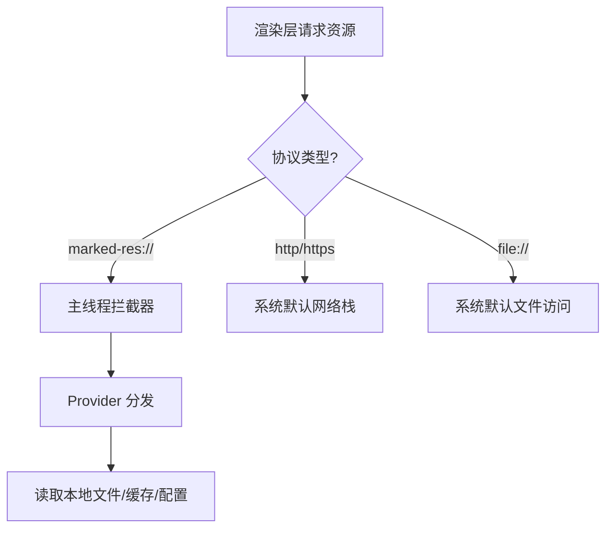

# Marked Editor URI 方案设计方案

本方案旨在为 Marked Editor 设计一套统一的资源标识符 (URI) 体系。通过该体系，编辑器可以透明地处理来自本地文件系统、数据库、远程网络、文档库以及特殊的 Markdown Bundle 的数据。

## 目标

- **统一化**：在 UI 和核心逻辑中使用单一的字符串格式标识资源。
- **可扩展性**：支持未来新增更多的数据存储源。
- **安全性与兼容性**：确保路径中的特殊字符（如 Windows 盘符、空格、中文、特殊符号）不会破坏 URI 语义。
- **解耦**：将 UI 层与具体的文件 I/O 逻辑解耦，通过 URI 路由到对应的 Provider。

## URI 结构设计

采用标准 URI 格式：
`marked://<provider>/<resource_info>[?query][#fragment]`

- **scheme**: 固定为 `marked`。
- **provider**: 资源提供者，标识存储类型（如 `file`, `db`, `web` 等）。
- **resource_info**: 资源在 Provider 内部的具体路径或 ID。**核心编码点，见下文详述**。
- **query**: 附加参数（如 `readonly`, `version`, `auth` 等）。
- **fragment**: 文档内部定位（如 `#L10-20` 或 `#heading-id`）。

---

## 编码规范 (Encoding)

针对您提到的 `resource_info` 可能导致 URL 无法识别（特别是包含 `C:\`, 空格, `#` 等字符的本地路径）的问题，我们有两种主要的处理方案：

### 方案 A：标准 URL 编码 (Percent-Encoding) - **推荐方案**
这是最符合标准的做法。
- **做法**: 使用 `encodeURIComponent` 对全路径进行编码。
- **示例**: 
  - 原始路径: `C:\Users\Albert\My Notes.md`
  - 编码后: `marked://file/C%3A%5CUsers%5CAlbert%5CMy%20Notes.md`
- **优点**: 
  - 开发者在调试时仍能肉眼识别路径（由于部分字符如 `%20` 很常见）。
  - 符合 Web 标准，所有 URL 处理库（如 `new URL()`）都能原生支持。
  - 浏览器控制台和日志工具友好。

### 方案 B：Base64 编码 (Base64Url)
- **做法**: 将整个路径转换为 Base64URL 格式。
- **示例**: 
  - 原始路径: `C:\Users\Albert\My Notes.md`
  - 编码后: `marked://file/QzpcVXNlcnNcQWxiZXJ0XE15IE5vdGVzLm1k`
- **优点**: 
  - **绝对安全**：彻底杜绝任何特殊字符对 URI 结构的干扰。
  - **长度固定**：不会因为特殊字符被编码转换后导致长度剧增（URL 编码中 1 个中文字符会变成 9 个字符）。
- **缺点**: 
  - **调试极其困难**：无法直接阅读资源指向，必须通过程序转换。
  - **性能损耗**：在大规模列表操作时，引入了额外的 Base64 编解码开销。

### 最终决策建议：双重兼容设计
为了兼顾易读性和安全性，建议：
1. **默认使用标准 URL 编码**。现代浏览器的 `URL` 对象和 Node.js 的 `url` 模块对 Percent-Encoding 的支持非常成熟，即使路径中有 `C:\` 也能被正确解析。
2. **特殊场景支持外部包装**：如果某些环境对 URI 长度有极致限制，或路径包含极其生僻的不可见字符，允许在 query 中指定编码类型，例如 `marked://file/<base64_data>?enc=b64`。

---

## 存储源 (Providers) 详细定义

### 1. 本地文件 (`file`)
用于访问用户本地硬盘上的文件。

- **格式**: `marked://file/<absolute_path>`
- **示例 (mac/linux)**: `marked://file/Users/albert/Documents/notes.md`
- **示例 (windows)**: `marked://file/C:/Users/albert/Documents/notes.md`
- **参数**:
  - `encoding`: 文件编码，默认 `utf-8`。
  - `readonly`: `true`/`false`。

### 2. Markdown Bundle (`bundle`)
用于处理特定的 Markdown 包。通常是一个包含 `index.md` 和配套资源（图片、附件）的文件夹。

- **格式**: `marked://bundle/<bundle_path>/[entry_file]`
- **示例**: `marked://bundle/Users/albert/Work/ProjectA.marked/index.md`
- **说明**: 这种模式下，所有资源引用（例如：`![]` 语法引用的图片）都相对于 bundle 根目录。

### 3. 应用数据库 (`db`)
用于存储在应用内部数据库（如 SQLite, IndexedDB）中的文档。

- **格式**: `marked://db/<collection>/<id>`
- **示例**: `marked://db/notes/550e8400-e29b-41d4-a716-446655440000`
- **说明**: `id` 为数据库中的主键。

### 4. 自定义文档库 (`lib`)
用于管理类似 Obsidian Vault、Notion Workspace 的逻辑库。

- **格式**: `marked://lib/<library_id>/<relative_path>`
- **示例**: `marked://lib/my-private-vault/work/drafts/october.md`
- **说明**: 通过 `library_id` 映射到真实的物理位置或配置。

### 5. 网络/远程文件 (`web`)
用于通过 HTTP/HTTPS 或自定义协议从互联网获取的文件。

- **格式**: `marked://web/<protocol>/<hostname>/<path>` (或简化封装原始 URL)
- **示例**: `marked://web/https/raw.githubusercontent.com/user/repo/main/README.md`
- **参数**:
  - `cache`: `true`/`false`。
  - `token`: 用于身份验证。

---

### 6. 应用配置 (`config`)
用于访问和修改应用的全局配置、插件设置或用户偏好。

- **格式**: `marked://config/<category>/<key>`
- **示例**: `marked://config/editor/theme`
- **说明**: 映射到 Electron 主线程管理的配置文件或 `electron-store`。

---

## 目录与库的处理 (Folder & Library)

当用户通过 Sidebar 菜单选择 `openDir` 获取到本地文件夹路径时，系统需进行以下转换：

### 1. 路径到 URI 的转换逻辑
不要直接在应用逻辑中使用原始物理路径，应当立即将其 **URI 化**：

- **普通文件夹**: 
  - 路径: `/Users/albert/Notes`
  - 转换为: `marked://file/Users/albert/Notes/` (注意以 `/` 结尾表示目录)
- **定义为库 (Library)**: 
  - 如果用户将该文件夹标记为“库”（即包含独立的设置、搜索索引），映射为: `marked://lib/<unique_id>/`
  - 主线程维护一个 `id -> physical_path` 的映射表。

### 2. Sidebar 树的构建
- **扫描逻辑**: Sidebar 调用 `resource:query(uri, { recursive: true })` 获取文件列表。
- **URI 传递**: 树中的每个节点（文件或子文件夹）都挂载其对应的 `marked://` URI。
- **优势**: 
  - **路径无关性**: 即使是云端数据库中的“文件夹”结构，也能以相同的方式在 Sidebar 渲染。
  - **右键操作统一**: 右键菜单的“新建”、“删除”操作发送的是 URI 消息，Provider 编辑器会自动处理底层差异。

---

## URI 规范化职责分配 (Responsibility)

关于路径到 URI 的转换（Normalization）放在哪一端，我们建议遵循 **“谁了解物理细节，谁负责规范化”** 的原则：

### 1. Electron 主进程的职责：物理到逻辑的映射
**必须在主进程完成**:
- **Dialog 返回处理**: 当 `IDialogService` (Electron 端) 获取到原始路径（如 `C:\Notes`）时，应当将其包装成 `marked://file/...` 后再返回给渲染进程。
- **文件系统监听**: `fs.watch` 捕获的事件路径，由主线程转换为 URI 后推送到渲染层。
- **Provider 解析**: 将 `marked://` 协议解析为真实的磁盘路径、数据库主键或网络 URL。

### 2. Web 渲染进程的职责：逻辑解析与展示
**在渲染层处理**:
- **相对路径转换**: 利用 **Editor Base URL** 将 `./img.png` 转换为 `marked-res://...`。
- **展示协议映射**: 为了 UI 显示，将 `marked://` 逻辑地址转换为 `marked-res://` 展示地址。
- **用户输入处理**: 用户手动输入路径时，将其发送给主线程进行“校验并 URI 化”。

### 3. IDialogService 交互规范
- **调用端 (Web)**: 调用 `dialog.openFile()`。
- **执行端 (Electron)**: 弹出系统对话框 -> 获取 `/abs/path` -> **核心步骤**: 调用内部转换函数 -> 返回 `marked://file/abs/path`。
- **优势**: 
  - **安全性**: 渲染层永远只接触 URI，不接触物理路径，降低攻击面。
  - **一致性**: 无论对话框选中的是物理文件还是特殊的虚拟资源，渲染层收到的格式永远统一。

---

## 外部拖拽资源处理 (External Drag & Drop)

当用户从系统资源管理器将文件拖入应用时，我们需要将 Web 层的物理路径信息转化为受控的 URI。

### 1. 拦截与转换流程
虽然 Web 端的 `DataTransfer` 不允许直接访问物理路径，但在 Electron 环境下我们可以通过以下链路实现：

1. **Web 端捕获**: 监听全局或局部 `onDrop` 事件，获取 `File` 对象。
2. **提取路径**: 利用 Electron 渲染进程的 `webUtils.getPathForFile(file)` 获取该文件的完整物理路径。
3. **主进程映射**: 将物理路径发送给主进程。
4. **URI 化**: 主进程通过 `toMarkedURI(physicalPath)` 将其包装为 `marked://file/...` 后返回给 Web 端。

### 2. 不同场景的 URI 处理

| 拖入区域 | 核心逻辑 |
| :--- | :--- |
| **编辑器 (Editor)** | 根据资产导入策略（Copy 或 Reference），主进程产生目标 URI 并将其插入 Markdown 文本。 |
| **文件树 (FileTree)** | 解析物理路径对应的父目录 URI，触发目录刷新或询问是否开启新 Library。 |
| **应用空白处** | 默认作为打开文件处理，将其物理路径转化为 `marked://file/` 并推送到已打开列表。 |

### 3. 安全沙箱要求
- 所有拖拽进入的路径必须由主进程重新校验 Provider 的合法性，防止通过人为构造的 `File` 对象绕过安全限制。

---

## 逻辑与操作设计

### 1. Electron 驱动的处理器 (Main-Thread Driven)
由于涉及文件系统、数据库和网络，所有的资源加载动作应由 Electron 主线程统一代理，渲染进程仅通过 URI 进行声明式请求。

这消除了渲染进程直接进行 `fs` 操作的需求，提高了安全性和中台化能力：

```typescript
// Electron 主线程中的分发逻辑示例
ipcMain.handle('resource:read', async (event, uriString: string) => {
  const uri = parseMarkedURI(uriString);
  const provider = getProvider(uri.provider);
  return await provider.read(uri);
});
```

### 2. Provider 接口定义
每一个存储源需实现统一接口：

```typescript
interface ResourceProvider {
  scheme: 'file' | 'bundle' | 'db' | 'lib' | 'web' | 'config';
  read(uri: MarkedURI): Promise<string | Buffer>;
  write(uri: MarkedURI, content: string | Buffer): Promise<void>;
  exists(uri: MarkedURI): Promise<boolean>;
  /**
   * 获取资源的渲染基准目录 (Base URL)，用于解析相对路径
   */
  getBaseURL(uri: MarkedURI): string; // 返回如 marked-res://file/path/to/dir/
  /**
   * 查询资源元数据、属性或进行复杂过滤
   */
  query(uri: MarkedURI, params?: Record<string, any>): Promise<any>;
}
```

---

## Editor Base URL 机制

为了让编辑器（如 Lexical）和 HTML 渲染层能正确解析相对路径，每个打开的文档都必须关联一个 **Base URL**。

### 1. Base URL 的生成逻辑
当主线程通过 `resource:read` 返回文档内容时，同时返回该资源的 `baseURL`。

- **规则**: Base URL 通常是当前文档 URI 的父目录，并转换为渲染层可识别的 `marked-res://` 协议。
- **示例**:
  - 文档 URI: `marked://file/Users/albert/note.md`
  - 推导出的 Base URL: `marked-res://file/Users/albert/`
  - 内部资源（如图片）的实际解析结果: 引擎会自动将文档中的 `./img.png` 与该 Base URL 拼接，形成 `marked-res://file/Users/albert/img.png`。

### 2. 注入与渲染应用
1. **编辑器初始化**: 渲染进程接收到文件内容和 `baseURL`。
2. **DOM 基础**: 在 HTML 预览层注入 `<base href="marked-res://...">` 标签（或在 Lexical 节点转换逻辑中利用此变量）。
3. **优势**: 
   - **自动化**: 开发人员无需手动拼接路径，标准浏览器行为即可正确加载相对路径资源。
   - **隔离性**: 即使文档来自远程 `web` 或 `db`，只要返回了对应的 `marked-res://` 基准地址，组件层逻辑无需任何修改。

---

## Markdown 内部资源引用方案

在 Markdown 中引用图片、附件等资源时，需要根据当前文档的 URI 环境进行解析。

### 1. 相对路径转换逻辑
当文档被加载后，渲染层会保留当前文档的 `contextURI`。

- **普通文件 (`file`)**: 
  - 文档 URI: `marked://file/Users/a/note.md`
  - 引用语法: `![]` 跟随相对路径（如 `./img.png`）
  - 转换后: `marked://file/Users/a/img.png`
- **Bundle (`bundle`)**:
  - 文档 URI: `marked://bundle/Users/a/MyProject.marked/index.md`
  - 引用语法: `![]` 跟随相对路径（如 `./assets/logo.png`）
  - 转换后: `marked://bundle/Users/a/MyProject.marked/assets/logo.png`
  - **优势**: 整个 Bundle 可以被整体移动，只要内部相对路径不变，URI 始终有效。

### 2. 虚拟资源协议处理
对于渲染进程中的 `` 标签，不能直接填入 `marked://`（浏览器不识别）。

- **主线程代理**: 在 Electron 中注册一个自定义协议（如 `marked-res://`）或使用 `protocol.handle` 直接拦截。
- **转换**: 渲染层使用 `marked-res://file/C%3A/Users/img.png` 作为 src。

### 3. 网络资源引用与处理 (Web Resources)
为了提升访问速度、支持离线查看并保护用户隐私，网络资源（如 `https://` 开头的图片）采用分层处理方案：

#### A. 渲染拦截模式 (Interceptor Mode)
- **行为**: 在 Markdown 文件中，路径**永远保持原始格式**（如 `https://...` 或 `./img.png`）。
- **拦截逻辑**: 当本编辑器加载该文件时，渲染引擎实时将这些原始路径视为 `marked://` 资源。
- **兼容性**: 这意味着使用其他编辑器打开时，它们看到的是标准的 Markdown。而在 Marked Editor 内部，它会通过 `marked-res://` 协议实现本地缓存加速和防盗链 Headers 注入。

#### B. 透明缓存与外部同步 (Cache & External Sync)
- **行为**: 即使路径是 `https://`，Marked Editor 也会在后台尝试缓存资源。
- **同步机制**: 
  - 如果用户在外部编辑器（如 VS Code）修改了 Markdown 中的图片引用，Marked Editor 通过监听文件变化 (`fs.watch`)，自动销毁旧的渲染快照并重新对新路径进行 `marked-res` 转换。
  - 由于引用地址保存在本地文件内，数据流始终以本地 Markdown 文件为准。

#### C. 资源本地化 (Localization / Materializing)
- **行为**: 用户手动执行“下载所有远程图片”操作。
- **转换**: Markdown 文本中的地址被修改为指向本地 Bundle 或特定目录。
  - 修改前: 使用网络 URL 的图片语法
  - 修改后: 使用相对路径的图片语法 (例如指向 `./assets/` 目录)
  - 解析逻辑: 转换后最终解析为 `marked://bundle/...` 或 `marked://file/...`。

#### D. 隐私与代理 (Privacy Proxy)
- **功能**: 对于某些防盗链或需要特定 User-Agent 的资源，主线程可以在读取 `marked://web/` 时动态注入 Headers，避免图片加载失败。

---

## 资源导入与管理方案 (Asset Management)

处理用户在 Marked Editor 内部添加新资源的行为：

### 1. 拖入本资源 (File Import)
- **粘贴/拖入图片**: 
  1. 系统根据配置的主路径（如当前文档同级的 `assets/`），将图片物理复制或移动到该位置。
  2. Markdown 文本中插入相对路径：例如指向 `./assets/my-image.png` 的标准语法。
  3. 渲染层立即将其捕获并映射为 `marked-res://file/...` 进行展示。
- **外部链接粘贴**: 识别 URL 后保持原样，按“网络资源处理”流程触发后台缓存。

### 2. 多设备同步建议
- 建议将 Markdown 文档与 `assets` 文件夹作为一个整体进行同步（例如放在 iCloud/Dropbox 驱动器中）。
- 这种“标准相对路径”方案保证了同步后的文件在任何设备上、任何编辑器下都能正确加载资源。

---

## 协议拦截与加载策略 (Protocol & Loading Strategy)

针对 Electron 的启动 (`loadURL`/`loadFile`) 以及标准路径的处理，我们采用以下策略：

### 1. 协议拦截边界 (To Intercept or Not?)

| 协议 | 是否拦截 | 处理策略 |
| :--- | :--- | :--- |
| `http/https` | **不拦截** | 保持系统默认行为。拦截可能导致 DevTools、三方 SDK 或标准网页加载异常。我们通过 `marked-res://web/...` 提供“受控”的加载，而不改变全局协议。 |
| `file` | **不拦截** | 保持默认以支持 `win.loadFile`。如果拦截 `file://`，可能导致应用自身的 HTML/JS 资源加载失败或破坏 Electron 的安全隔离模型。 |
| `marked-res` | **必须拦截** | 这是我们的逻辑层到渲染层的桥梁，用于处理所有受控资源（包括缓存的网络资源和隔离的文件资源）。 |

### 2. Electron 加载策略 (`loadURL` vs `loadFile`)

#### A. 渲染主窗口 (Main Window)
- **开发模式**: 使用 `win.loadURL('http://localhost:5173')`。此处不需要拦截 `http`，因为这是标准的 Web 开发流程。
- **生产模式**: 使用 `win.loadFile('dist/index.html')`。这是最推荐的方式，具有最高的安全性。

#### B. 编辑器子窗口 (Editor Window)
- **参数传递**: 启动时通过 URL Query 或 Hash 传递文档的 **Marked URI** 而非原始物理路径。
  - 示例: `win.loadURL('...#/editor?uri=marked%3A%2F%2Ffile%2FUsers%2Fa%2Fnote.md')`
- **逻辑**: 编辑器窗口启动后，从 URI 中解析出 Base URL，并通过 `marked-res://` 协议请求后续所有资产。

### 3. 拦截流程图


---

## 链接资源处理 (Link & Navigation Handling)

Markdown 中的 `[Label](url)` 链接与图片等嵌入资源的处理方式略有不同，其核心是“导航”而非“预览”。

### 1. 外部网页链接 (`https://`)
- **行为**: 点击后调用 `shell.openExternal(url)` 在用户系统默认浏览器中打开。
- **目的**: 避免在编辑器窗口内加载外部网页，保证应用安全性并符合用户直觉。

### 2. 文档间跳转 (`marked://`)
- **行为**: 
  1. 渲染层拦截点击事件。
  2. 如果目标是 `marked://file/...` 或 `marked://db/...`，则向主线程发送 `open_new_window` 或 `switch_document` 消息。
  3. 主线程根据 URI 加载新文档。
- **相对路径转换**: 
  - 引用: `[跳转到新方案](./new_plan.md)`
  - 逻辑: 同样基于 **Editor Base URL** 转换为 `marked://file/.../new_plan.md`。

### 3. 非预览类附件 处理 (`.zip`, `.exe`, `.dmg`)
- **行为**: 
  - 对于浏览器无法嵌入展示的资源，点击链接时触发“在访达中显示 (Reveal in Finder)”或弹出下载/保存对话框。
  - 路径同样经过物理安全校验。

### 4. 锚点定位 (`#fragment`)
- **行为**: 
  - 同一文档内的跳转由编辑器前端（如 Lexical 或展示层）处理滚动力度。
  - 跨文档跳转时，主线程打开文档后由渲染层解析 Fragment 并定位。

---

## AI 资源访问支持 (AI-Ready)

当 AI 处理 Markdown 文档并需要访问其中的图片、表格或附件进行多模态分析时，URI 方案提供了统一的桥梁。

### 1. AI 读取流程
1. **上下文提取**: AI 获取 Markdown 文本。
2. **URI 转换**: 系统工具（Tool）自动将文本中的相对路径转换为绝对的 `marked://` URI。
3. **按需读取**: AI 通过专门的工具（如 `read_marked_resource`）请求特定资源。

### 2. AI 视角下的资源操作
- **多模态感知**: AI 识别出图片引用语法（例如指向 `./data/sales.png`），它会通过工具请求 `marked://file/.../sales.png` 的内容进行视觉分析。
- **关联搜索**: AI 可以通过 `query` 接口搜索库内的关联文档：
  `marked.query('marked://lib/my-vault/', { search: 'Project Alpha' })`
- **附件解析**: 对于 PDF 或 Excel 类型的引用，AI 调用 `read` 获取 Buffer 后，通过对应的解析器转换成其可理解的文本/结构化数据。

### 3. 安全沙箱
AI 所有的资源访问都受限于 `ResourceProvider` 的权限校验，确保 AI 只能访问当前文档及其关联范围内的安全资源。

## 验证计划 (初步思路)

1. **单元测试**: 针对 `URIParser` 编写测试用例，确保路径编码、Windows 盘符等处理正确。
2. **模拟 Provider**: 实现 `MockFileProvider` 验证分发逻辑。
3. **UI 验证**: 在侧边栏模拟各源节点，验证点击能正确路由。

> [!IMPORTANT]
> 所有的路径在 URI 化时必须进行 URL 编码 (`encodeURIComponent`)，防止路径中的特殊字符（如 `#`, `?`, ` `）干扰 URI 解析。

> [!TIP]
> 考虑到向后兼容，如果传入的字符串不以 `marked://` 开头，默认视为本地绝对路径（即 `file` scheme）。
